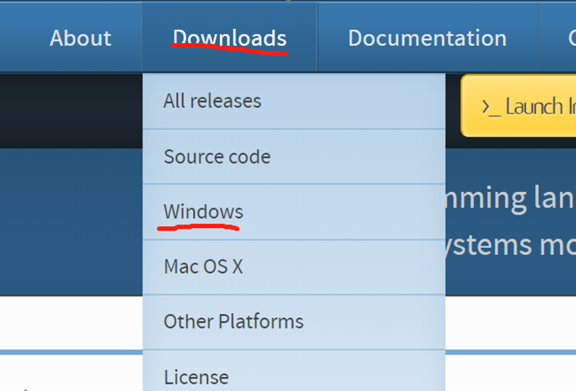
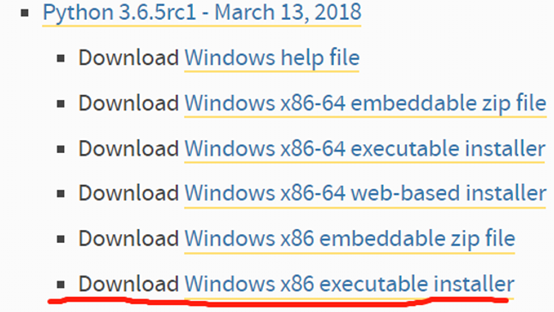
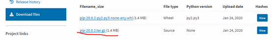
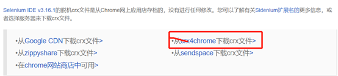
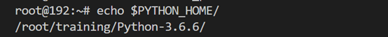

## Python+Selenium IDE自动化测试环境的搭建
### 一、Windows平台
###### 1.在浏览器(建议使用谷歌浏览器，自带翻译功能)中百度搜索python进入python官网，点击Downloads(下载)选择Windows平台(如下图所示)  
  
###### 2.根据自己计算机选择符合的python版本，这里选择python3.6.5(当然你也可以选择其他版本，这里不建议选择最新版本，最新版本可能不稳定,如下图)  
  
###### 3.下载成功后双击打开执行程序，记得勾选“Add python 3.6 to path”,这样系统安装的时候就自动配置和环境变量，点击点击“install now”让系统自动安装  
  
###### 4.安装完成后，cmd命令进入电脑终端输入python，进入python执行环境下，如下图显示安装成功  
.jpg )  
###### 5.安装pip，下载地址是：https://pypi.org/project/pip/#files(win7.8.9.10 下，记得下载压缩文件)下载完成之后，解压到一个文件夹，用CMD控制台进入解压文件的目录 （目录中不要包含汉字。放到比较好找的位置）。然后，在cmd终端文件目录下，输入：python setup.py install  
  
###### 6.安装完成后,执行pip3 install selenium安装selenium。这样我们的python+selenium环境都安装好了
###### 7.安装完成后,根据执行的脚本文件所需要的第三方包,自行安装(pip3 install 包名)
###### 8.接下来我们下载最新版本的firefox(火狐浏览器)，安装成功后，打开火狐浏览器点击右上角菜单，选择web开发者，选择获取更多工具，点击selenium IDE，点击添加到firefox,如果是谷歌浏览器打开链接 (https://www.crx4chrome.com/crx/77585/)点击按钮下载selenium IDE (这是3.16.1版本)  

  

###### 9.下载成功后打开谷歌浏览器，点击右上角，选择更多工具》扩展程序，将下载好的文件拖到空白处，进行selenium IDE安装，如果安装成功，如下图，右上角会有selenium IDE安装成功的提示  

  

### 二、Linux平台
###### 1.安装python环境
这里以3.6.6为例  
终端执行命令 wget https://www.python.org/ftp/python/3.6.6/Python-3.6.6.tgz
###### 2.下载python3的依赖包
  yum install -y gcc patch libffi-devel python-devel  zlib-devel bzip2-devel openssl-devel ncurses-devel sqlite-devel readline-devel tk-devel gdbm-devel db4-devel libpcap-devel xz-devel(如果提示yum指令错误，先安装apt-get install yum)
###### 3.解压tar -zxvf Python-3.6.6.tgz，进入Python-3.6.6执行以下命令  
./configure --prefix=/root/training/Python-3.6.5  
make  
make install
###### 4.配置环境变量(执行命令 vi ~/.bash_profile) 
添加以下到文件中   
export PYTHON_HOME=/root/training/Python-3.6.6  
export PATH=$PYTHON_HOME/bin:$PATH  
###### 5.执行source ~/.bash_profile命令使配置生效 执行echo命令，查看是否配置成功，如图  
 
###### 6. 同样根据执行的脚本文件所需要的第三方包,自行安装(pip3(apt-get) install 包名)
###### 7.下载Linux系统的火狐与谷歌浏览器,并安装Selenium IDE插件(与windows平台类似,这里就不在介绍了)

