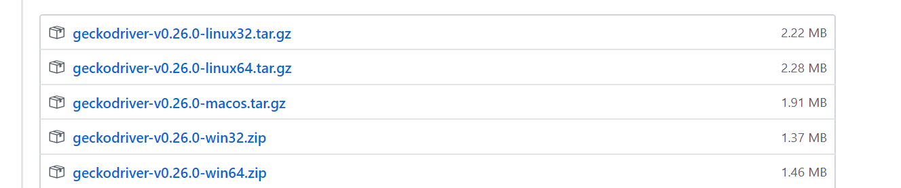
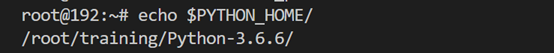
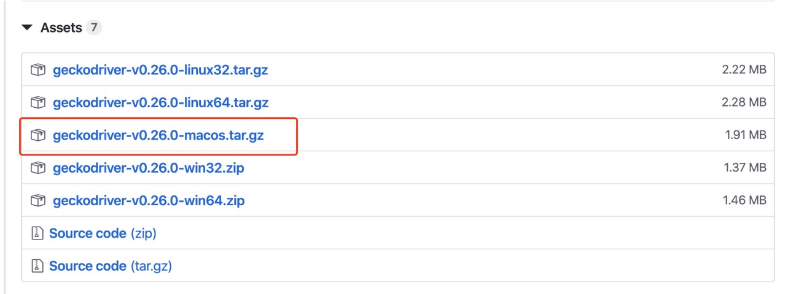

## Python+Selenium IDE自动化测试环境的搭建
### 一、Windows平台
#### 1.在浏览器(建议使用谷歌浏览器，自带翻译功能)中百度搜索python进入python官网，点击Downloads(下载)选择Windows平台(如下图所示)  
  
#### 2.根据自己计算机选择符合的python版本，这里选择python3.6.5(当然你也可以选择其他版本，这里不建议选择最新版本，最新版本可能不稳定,如下图)  
  
#### 3.下载成功后双击打开执行程序，记得勾选“Add python 3.6 to path”,这样系统安装的时候就自动配置和环境变量，点击点击“install now”让系统自动安装  
  
#### 4.安装完成后，cmd命令进入电脑终端输入python，进入python执行环境下，如下图显示安装成功  
.jpg )  
#### 5.安装pip，下载地址是：https://pypi.org/project/pip/#files(win7.8.9.10 下，记得下载压缩文件)下载完成之后，解压到一个文件夹，用CMD控制台进入解压文件的目录 （目录中不要包含汉字。放到比较好找的位置）。然后，在cmd终端文件目录下，输入：python setup.py install  
  
#### 6.安装完成后,执行pip3 install selenium安装selenium。这样我们的python+selenium环境都安装好了
#### 7.安装完成后,根据执行的脚本文件所需要的第三方包,自行安装(pip3 install 包名)
#### 8.接下来我们下载最新版本的firefox(火狐浏览器)，安装成功后，打开火狐浏览器点击右上角菜单，选择web开发者，选择获取更多工具，点击selenium IDE，点击添加到firefox,如果是谷歌浏览器打开链接 (https://www.crx4chrome.com/crx/77585/)点击按钮下载selenium IDE (这是3.16.1版本)  

   
#### 9.安装火狐浏览器的驱动，下载Geckodriver结合计算机的版本及火狐浏览器的版本，下载对应的版本  
点击链接https://github.com/mozilla/geckodriver/releases,(v0.26.0适用于Firefox≥60)，并配置到python的环境变量中(将下载下来的GeckoDriver.exe放入python安装路径下的Scripts文件夹内) 

  
#### 10.下载成功后打开谷歌浏览器，点击右上角，选择更多工具》扩展程序，将下载好的文件拖到空白处，进行selenium IDE安装，如果安装成功，如下图，右上角会有selenium IDE安装成功的提示  

  
#### 11.下载谷歌浏览器驱动,通样根据计算机自身谷歌浏览器版本下载对应的chromedriver  
点击链接http://chromedriver.storage.googleapis.com/index.html，下载谷歌浏览器对应的文件(本机谷歌浏览器版本81.0,对应的chromedriver版本也为81.0)  
复制文件到python的环境变量中(同步骤9),同样文件复制到chrome.exe所在目录  
#### 12.IE浏览器驱动的下载  
1.下载IEDriverServer(http://dl.pconline.com.cn/download/771640-1.html)  
2.解压缩得到IEDriverServer.exe和IEDriverServer.64.exe，其实只能用IEDriverServer.exe即可驱动IE11，并将其所复制到Python的安装目录下  
3.针对windows vista和windows 7上的IE7或者更高的版本，必须在IE选项设置的安全页中，4个区域的启用保护模式的勾选都去掉（或都勾上），即保持四个区域的保护模式是一致的。如下图所示  
  
4.针对IE10和更高的版本，必须在IE选项设置中的高级页中，取消增强保护模式。如下图所示  
  
5.调整浏览器的缩放比例必须设置为100%，这样元素定位才不会出现问题  
6.针对IE11，需要修改注册表。如果是32位的windows，key值为HKEY_LOCAL_MACHINE\SOFTWARE\Microsoft\InternetExplorer\Main\FeatureControl\FEATURE_BFCACHE  
如果是64位的windows，key值为HKEY_LOCAL_MACHINE\SOFTWARE\Wow6432Node\Microsoft\InternetExplorer\Main\FeatureControl\FEATURE_BFCACHE  
如果key值不存在，就添加。之后在key内部创建一个iexplorer.exe，DWORD类型，值为0，我的windows是64位的，修改后的注册表如下图所示:  
  
之后Selenium就可以正常打开ie浏览器  
#### 注：如果时间已久，以上网址如有访问不了请自行下载文件

### 二、Linux平台
#### 1.安装python环境
这里以3.6.6为例  
终端执行命令 wget https://www.python.org/ftp/python/3.6.6/Python-3.6.6.tgz
#### 2.下载python3的依赖包
  yum install -y gcc patch libffi-devel python-devel  zlib-devel bzip2-devel openssl-devel ncurses-devel sqlite-devel readline-devel tk-devel gdbm-devel db4-devel libpcap-devel xz-devel(如果提示yum指令错误，先安装apt-get install yum)
#### 3.解压tar -zxvf Python-3.6.6.tgz，进入Python-3.6.6执行以下命令  
./configure --prefix=/root/training/Python-3.6.5  
make  
make install
#### 4.配置环境变量(执行命令 vi ~/.bash_profile) 
添加以下到文件中   
export PYTHON_HOME=/root/training/Python-3.6.6  
export PATH=$PYTHON_HOME/bin:$PATH  
#### 5.执行source ~/.bash_profile命令使配置生效 执行echo命令，查看是否配置成功，如图  
 
#### 6. 同样根据执行的脚本文件所需要的第三方包,自行安装(pip3(apt-get) install 包名)
#### 7.下载Linux系统的火狐与谷歌浏览器,并安装Selenium IDE插件(与windows平台类似,这里就不在介绍了)  
#### 8.安装火狐浏览器驱动
1.安装火狐 firefox  
sudo yum install firefox  
2.在(https://github.com/mozilla/geckodriver/releases)下载最新的geckodriver将压缩包移动到linux环境下(或者直接在linux下载压缩包)，并解压，进入文件所在目录执行(mv geckodriver /usr/bin)
##### 注：如果报connect refuse 类似的错误，有可能是驱动不支持当前的浏览器版本或者是不支持selenium 版本，需要换个版本的驱动，0.21.0支持 firefox57以及更高版本 selenium 3.11（及更高版本）
#### 9.安装谷歌浏览器驱动
1.安装谷歌浏览器  
对于64位版本可以使用如下链接下载：
wget https://dl.google.com/linux/direct/google-chrome-stable_current_amd64.deb  
下载完后，运行如下命令安装。 sudo dpkg -i google-chrome*  sudo apt-get -f install
然后，就可以去搜索使用了。
2下载chromedriver  
wget https://chromedriver.storage.googleapis.com/2.40/chromedriver_linux64.zip  
3.解压chromedriver  
unzip chromedriver_linux64.zip  
4.移动chromedriver  
mv chromedriver /usr/bin/


### 三、MacOS平台

#### 安装Python环境
- 点击该链接<https://www.python.org/ftp/python/3.7.6/python-3.7.6-macosx10.6.pkg>，下载完成后得到一个python-3.7.6-macosx10.6.pkg安装包。  
- 双击python-3.7.6-macosx10.6.pkg进入Python安装向导，若出现"身份不明"等问题，进入‘设置-->安全性与隐私-->通用’界面点击“仍要打开”，如下图所示：  

  
然后按照向导一步一步向下安装，一切保持默认即可。  

  
- 安装完成后按command+空格键进入聚焦搜索，输入‘terminal’回车进入终端，在终端中输入```python3 --version```命令即可查看Python版本。  
- 在终端中输入
```curl https://bootstrap.pypa.io/get-pip.py | python3```
安装pip
- 完成后输入```pip3 --version```查看pip版本，安装成功。
  
#### 安装Python下的selenium执行环境
在终端（terminal）中输入```python3 -m pip install selenium```，如下图所示：  

  

再根据执行脚本自行安装所需第三方包，使用```pip3 install 包名```命令即可安装。

#### 安装火狐浏览器(Firefox)IDE
- 下载最新版本的火狐浏览器  
- 打开<https://addons.mozilla.org/en-US/firefox/addon/selenium-ide/>进入页面
- 点击右侧菜单，打开web开发者-->获取更多工具，然后在搜索框中搜索‘selenium’，点击‘Selenium IDE’一项进入页面，点击“+ 添加到FireFox”后依据步骤选择确定即可。  
  
  
  
  

#### 安装火狐浏览器(Firefox)驱动
- 点击进入<https://github.com/mozilla/geckodriver/releases>  
- 选择对应版本的压缩包点击下载，注意为macos标识
  
- 解压下载好的文件geckodriver，使用 ```sudo mv 文件路径 /usr/local/bin```将下载好的可执行文件移动到/usr/local/bin目录中，输入管理员密码运行。  


#### 安装谷歌浏览器(Chrome)IDE
- 打开<https://chrome.google.com/webstore/detail/selenium-ide/mooikfkahbdckldjjndioackbalphokd>进入页面  
- 点击“添加至Chrome”后依据步骤选择确定即可。  


#### 安装谷歌浏览器(Chrome)驱动

- 首先查看自己的Chrome版本，点击浏览器右侧菜单-->设置-->关于Chrome，查看版本号。  
  

- 进入<https://sites.google.com/a/chromium.org/chromedriver/downloads>页面，选择与自己浏览器对应的版本点击下载，注意选择mac版本。  
  
  
- 解压下载好的文件chromedriver，进入终端使用 ```sudo mv 文件路径 /usr/local/bin```命令将下载好的可执行文件移动到/usr/local/bin目录中，输入管理员密码运行。  


#### 配置苹果浏览器(Safari)
- 检查菜单栏有无“开发”选项，没有的话进入Safari浏览器-->偏好设置-->高级，勾选“在菜单栏中显示‘开发’菜单”选项。  


- 选中开发选项，在下拉项中勾选“允许远程自动化”即可。

  


### 四、Selenium IDE常用命令
#### add selection
将选择添加到多选元素中的选项集.  
```参数：```locator：元素定位器。value：要输入的值。
#### answer on next prompt
影响下一个警报提示。此命令将向其发送指定的答案字符串。如果警报已经存在，请改用“可见提示时的webdriver回答”.  
```参数：```answer：提示弹出窗口时给出的答案
#### assert  
检查变量是否为期望值。变量的值将转换为字符串以进行比较。如果断言失败，则测试将停止.  
```参数```variable name(变量名)：不带括号的变量名.expected value(期望值):您期望变量包含的结果（例如，true，false或其他某个值）
#### assert alert  
确认已使用提供的文本呈现警报。如果断言失败，则测试将停止  
```参数```alert text(提示内容): 要检查的内容  
#### assert checked
确认目标元素已被检查。如果断言失败，则测试将停止。  
```参数```locator：元素定位器  
#### assert confirmation  
确认已提交确认。如果断言失败，则测试将停止。  
```参数```text：要使用的文本  
#### assert editable
确认目标元素是可编辑的。如果断言失败，则测试将停止。  
```参数```locator：元素定位器。  
#### assert element present
确认目标元素存在于页面上的某处。如果断言失败，则测试将停止。  
```参数```locator：元素定位器。  
#### assert element not present
确认目标元素不在页面上任何地方。如果断言失败，则测试将停止。  
```参数```locator：元素定位器。
#### assert not checked
确认尚未检查目标元素。如果断言失败，则测试将停止。  
```参数```locator：元素定位器
#### assert not editable
确认目标元素不可编辑。如果断言失败，则测试将停止  
```参数```locator：元素定位器
#### assert not selected value
确认下拉元素中所选选项的value属性不包含提供的值。如果断言失败，则测试将停止。  
```参数```  
select locator：标识下拉菜单的元素定位器。  
text：完全匹配的字符串。正在支持模式匹配。有关详细信息，请参见https://github.com/SeleniumHQ/selenium-ide/issues/141。  
#### assert not text
确认元素的文本不包含提供的值。如果断言失败，则测试将停止。  
```参数```  
locator：元素定位器。  
text：完全匹配的字符串。正在支持模式匹配。有关详细信息，请参见https://github.com/SeleniumHQ/selenium-ide/issues/141。

#### assert prompt
确认已呈现JavaScript提示。如果断言失败，则测试将停止。
```参数```text：要使用的文本  
#### assert selected value
确认下拉元素中所选选项的value属性包含提供的值。如果断言失败，则测试将停止。  
```参数```  
select locator：标识下拉菜单的元素定位器。  
text：完全匹配的字符串。正在支持模式匹配。有关详细信息，请参见https://github.com/SeleniumHQ/selenium-ide/issues/141。

#### assert selected label
确认下拉菜单中所选选项的标签包含提供的值。如果断言失败，则测试将停止。
```参数```  
select locator：标识下拉菜单的元素定位器。  
text：完全匹配的字符串。正在支持模式匹配。有关详细信息，请参见https://github.com/SeleniumHQ/selenium-ide/issues/141。  
#### assert text
确认元素的文本包含提供的值。如果断言失败，则测试将停止。
```参数```  
select locator：标识下拉菜单的元素定位器。  
text：完全匹配的字符串。正在支持模式匹配。有关详细信息，请参见https://github.com/SeleniumHQ/selenium-ide/issues/141。。
#### assert title
确认当前页面的标题包含提供的文本。如果断言失败，则测试将停止。  
```参数```
text：完全匹配的字符串。正在支持模式匹配。有关详细信息，请参见https://github.com/SeleniumHQ/selenium-ide/issues/141。  
#### assert value
确认输入字段的（空白修饰）值（或其他带有value参数的值）。对于复选框/无线电元素，根据是否选中该元素，其值为“ on”或“ off”。如果断言失败，则测试将停止。  
```参数```  
locator：元素定位器。  
text：完全匹配的字符串。正在支持模式匹配。有关详细信息，请参见https://github.com/SeleniumHQ/selenium-ide/issues/141。

#### check
检查一个切换按钮（复选框/单选）。  
```参数```locator：元素定位器
#### choose cancel on next confirmation
影响下一个确认警报。此命令将取消它。如果警报已经存在，则使用“ webdriver选择在可见确认时取消”。
#### choose cancel on next prompt
影响下一个警报提示。此命令将取消它。如果警报已经存在，则使用“ webdriver在可见的提示下选择取消”。
#### choose ok on next confirmation
影响下一个确认警报。此命令将接受它。如果警报已经存在，则使用“ Webdriver在可见确认中选择确定”。
#### click
单击目标元素（例如，链接，按钮，复选框或单选按钮）。  
```参数```locator：元素定位器。

#### click at
单击目标元素（例如，链接，按钮，复选框或单选按钮）。坐标相对于目标元素（例如，0,0是元素的左上角），并且主要用于检查在其上传递的效果，例如材料波纹效果。  
```参数```locator：元素定位器,坐标字符串：指定鼠标事件相对于从定位器找到的元素的x，y位置（例如-10,20）  
#### close
关闭当前窗口。无需关闭初始窗口，IDE会重新使用它；关闭它可能会导致测试性能下降。
#### debugger
中断执行并进入调试器
#### do
创建一个至少执行一次执行命令的循环。使用repeat if命令终止分支。
#### double click
双击元素（例如，链接，按钮，复选框或单选按钮）。  
```参数```locator：元素定位器。  
#### drag and drop to object
拖动一个元素并将其拖放到另一个元素上。
```参数```  
要拖动的对象的定位器：要拖动的元素的定位器。  
拖动目标对象的定位器：放置元素（其位置（例如，其中的最中心像素）将成为要拖动的对象的定位器）的点的定位器。
#### echo
将指定的消息打印到Selenese表中的第三个表单元格中。对于调试很有用。
```参数```message：要打印的消息。
#### edit content
设置内容可编辑元素的值，就像您在其中键入一样。
```参数```
locator：元素定位器。
value：要输入的值。
#### else
if块的一部分。如果不满足if和/或else if条件，请在此分支中执行命令。使用end命令终止分支。

#### else if
if块的一部分。如果不满足if条件，请在此分支中执行命令。使用end命令终止分支。
```参数```
条件表达式：JavaScript表达式，它返回布尔值以用于控制流命令。
#### end
终止控制流块是否为时，为时和为时间。
#### execute script
在当前选定的框架或窗口的上下文中执行一段JavaScript。脚本片段将作为匿名函数的主体执行。要存储返回值，请使用“ return”关键字，并在值输入字段中提供变量名称。  
```参数```
script：要运行的JavaScript代码段。
变量名：不带括号的变量名。
#### execute async script
在当前选定的框架或窗口的上下文中执行JavaScript的异步代码段。脚本片段将作为匿名函数的主体执行，并且必须返回Promise。如果您使用'return'关键字，则Promise结果将保存在变量中。  
```参数```
script：要运行的JavaScript代码段。
变量名：不带括号的变量名。

#### for each
创建一个循环，为给定集合中的每个项目执行执行命令。  
```参数```  
数组变量名称：包含JavaScript数组的变量的名称。  
迭代器变量名称：在循环控制流命令中迭代集合时（例如，针对每个变量）使用的变量名称。
#### if
在测试中创建条件分支。使用end命令终止分支。  
```参数``` 
条件表达式：JavaScript表达式，它返回布尔值以用于控制流命令。
#### mouse down
模拟用户按下鼠标左键（尚未释放它）。  
```参数```locator：元素定位器。
#### mouse down at
模拟用户在指定位置按下鼠标左键（尚未释放它）。  
```参数```locator：元素定位器。  
坐标字符串：指定鼠标事件相对于从定位器找到的元素的x，y位置（例如-10,20）。

#### mouse move at
模拟用户在指定元素上按下鼠标按钮（尚未释放它）。
```参数```locator：元素定位器。  
坐标字符串：指定鼠标事件相对于从定位器找到的元素的x，y位置（例如-10,20）。


